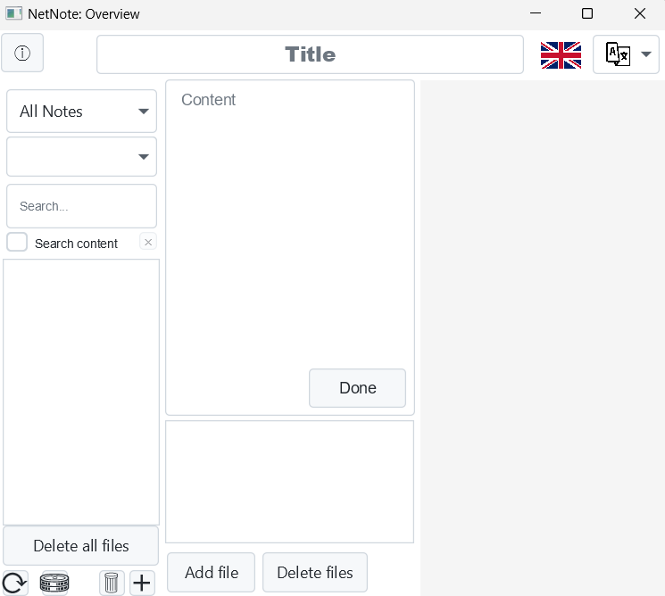
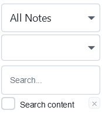
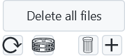
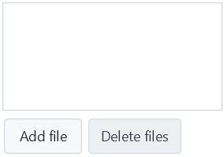
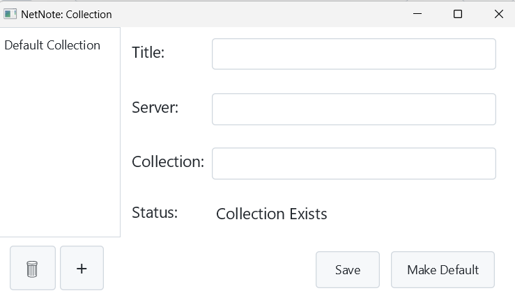
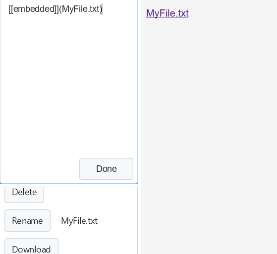
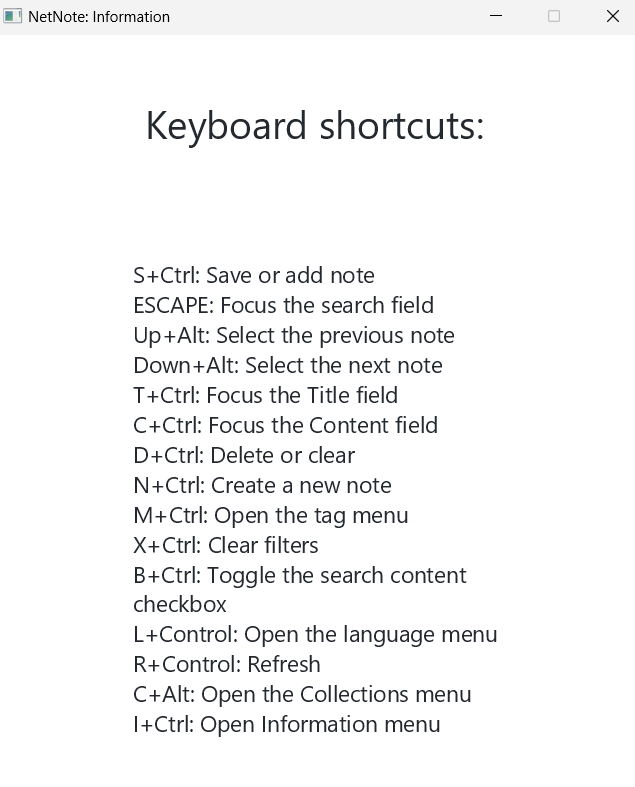

## CSEP Project Features Guide

This is the main view of the app and where most of the functionality resides.

### Key elements of the main view:

- The **filter area** (from top to bottom):
  - The collection filter
  - The tag filter (empty until tags are added)
  - The search bar: implicitly searches notes by title
  - The search-by-content checkbox: toggles searching notes by content

- The **control area** (top to bottom, left to right):
  - The delete all files button
  - The refresh button
  - The collection access button
  - The delete note button (has to have a note selected)
  - The add new note button

- The **file area**:
  - The file list (empty until a file is uploaded)
  - The add file to note button
  - The delete all files in selected note button

### 4.2 Multi-Collection

Once the user clicks on the collection button, the collection view appears.
Here, similarly to the main view, the user can add, modify and delete collections.

### 4.3 Embedded Files

Once the user adds a file, they can delete, rename or download it, as well as embed it with the following syntax:  
`[[embedded]](MyFile.txt)`.  
This generates a link, and for photos a preview, both of which can be accessed in the WebView.

### 4.4 Interconnected content
Tags can be added, viewed and accessed as specified in the backlog.
The small x symbol in the filtering area can be used to remove all tag filtering at once if multiple tags are selected.

### Accessibility

The information symbol at the top left of the application's main view opens a tab with descriptions of all the available shortcuts for the app.

